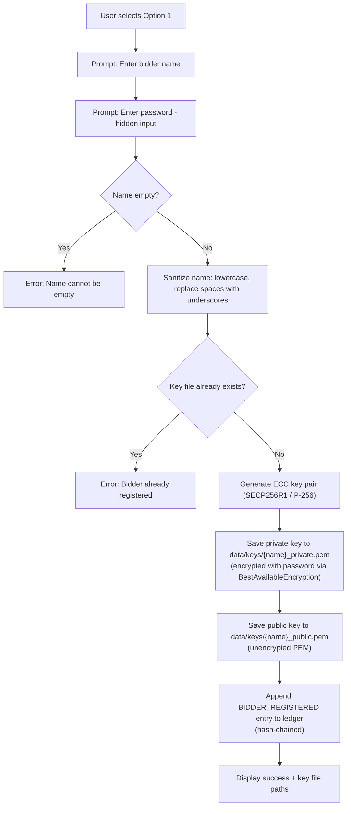

# Option 1 — Register as Bidder

## Overview

Registers a new bidder in the CSePS system by generating an **ECC key pair** (SECP256R1 / P-256), saving the keys to disk, and recording the registration event on the **tamper-proof hash-chain ledger**.

---

## Full Workflow (Step-by-Step)



### 1. User Input
- **Bidder name** — free-text identifier (e.g., `Alice`).
- **Password** — entered via hidden `getpass` input; used to **encrypt the private key at rest**.

### 2. Name Sanitization
```python
safe_name = name.strip().lower().replace(" ", "_")
```
The name is lowercased and spaces become underscores (e.g., `"  Alice Corp "` → `"alice_corp"`).

### 3. Duplicate Check
The system checks if `data/keys/{safe_name}_private.pem` already exists. If so, registration is **rejected** with a `ValueError`.

### 4. ECC Key Pair Generation
```
Algorithm:  ECDSA on SECP256R1 (P-256)
Key size:   256-bit private scalar, 512-bit public point (uncompressed)
Library:    cryptography.hazmat.primitives.asymmetric.ec
```
- A new **private key** (random 256-bit scalar on the P-256 curve) is generated.
- The corresponding **public key** (a point on the curve) is derived.

### 5. Key Storage
| File | Format | Encryption |
|------|--------|------------|
| `data/keys/{name}_private.pem` | PKCS#8 PEM | AES-encrypted with user password (`BestAvailableEncryption`) |
| `data/keys/{name}_public.pem` | SubjectPublicKeyInfo PEM | None (public data) |

### 6. Ledger Entry
A `BIDDER_REGISTERED` event is appended to the hash-chain ledger:
```json
{
  "index": <sequential>,
  "timestamp": "<UTC ISO-8601>",
  "event_type": "BIDDER_REGISTERED",
  "data_hash": "SHA-256(bidder:{safe_name})",
  "previous_hash": "<hash of previous entry>",
  "entry_hash": "SHA-256(index + timestamp + event_type + data_hash + previous_hash)",
  "metadata": { "bidder_name": "alice" }
}
```

### 7. Output
```
[  OK ]  Bidder 'alice' registered successfully!
[INFO]  Private key: data/keys/alice_private.pem
[INFO]  Public key:  data/keys/alice_public.pem
[INFO]  Registered event logged to ledger.
```

---

## Cryptographic Mechanisms Used

| Mechanism | Purpose | Algorithm |
|-----------|---------|-----------|
| ECC Key Generation | Create identity key pair | SECP256R1 (P-256) |
| Private Key Encryption | Protect key at rest | AES via `BestAvailableEncryption` |
| SHA-256 Hashing | Hash-chain ledger entry | SHA-256 |

---

## 🔒 Security Highlights

### What the project does well
1. **Password-protected private keys** — Private keys are encrypted at rest using the user's password, preventing raw key theft from disk.
2. **Immutable registration record** — The ledger entry is hash-chained, so backdating or deleting a registration is detectable.
3. **Standard cryptographic curve** — SECP256R1 (P-256) is NIST-approved and widely trusted.

### ⚠️ Security Concerns

> [!CAUTION]
> **No password strength enforcement** — The system accepts any password, including empty strings or `"123"`. A weak password makes the private key encryption trivially breakable.

> [!WARNING]
> **No username uniqueness beyond file existence** — Uniqueness relies on checking if a `.pem` file exists on disk. In a concurrent or networked environment, a race condition could allow duplicate registrations.

> [!WARNING]
> **Password is not hashed/stored** — There is no separate credential store. If the user forgets their password, the private key is irrecoverable. There is also no session management — the password is re-entered every time.

> [!CAUTION]
> **Private keys stored on local filesystem** — Keys sit as PEM files in `data/keys/`. Anyone with filesystem access on the machine can copy the encrypted PEM and attempt offline brute-force.

---

## 🌍 Differences from Real-World Scenarios

| Aspect | This Prototype | Real-World e-Procurement |
|--------|---------------|--------------------------|
| **Identity verification** | Self-registration, no ID check | Government-issued digital certificates (e.g., DSC — Digital Signature Certificate), KYC verification, CA-backed identity |
| **Key management** | PEM files on local disk | Hardware Security Modules (HSMs), smart cards, cloud KMS |
| **Password policy** | No requirements at all | Minimum length, complexity, MFA/2FA required |
| **Registration authority** | None — anyone can register any name | Central Registration Authority verifies business legitimacy |
| **Credential storage** | No database, just file existence | Centralized DB with salted+hashed passwords, OAuth/SAML |
| **Certificate chain** | No PKI, self-generated keys | Full PKI hierarchy — Root CA → Intermediate CA → End-entity certificate |
| **Revocation** | No mechanism to revoke a compromised key | CRL (Certificate Revocation Lists), OCSP responders |
| **Audit trail** | Local JSON ledger | Distributed ledger / blockchain with consensus, timestamped by certified TSA |
| **Session management** | None (stateless CLI) | Token-based sessions (JWT), session timeouts, IP binding |
