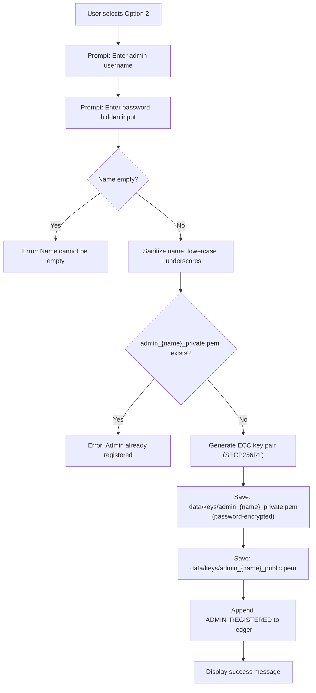

# Option 2 — Register as Admin/User

## Overview

Registers a new **administrative user** in the CSePS system. Admins are responsible for creating tenders and opening bids after deadlines. Like bidder registration, an ECC key pair is generated, but admin keys are prefixed with `admin_` and the admin has elevated privileges.

---

## Full Workflow (Step-by-Step)



### 1. User Input
- **Admin username** — e.g., `procurement_officer`.
- **Password** — hidden input, encrypts the private key at rest.

### 2. Name Sanitization
```python
safe_name = name.strip().lower().replace(" ", "_")
```

### 3. Duplicate Check
Checks if `data/keys/admin_{safe_name}_private.pem` exists. Note the `admin_` prefix differentiates admin keys from bidder keys.

### 4. ECC Key Pair Generation
Identical to bidder registration:
```
Curve:    SECP256R1 (P-256)
Format:   PKCS#8 PEM (private), SubjectPublicKeyInfo PEM (public)
```

### 5. Key Storage

| File | Encryption |
|------|------------|
| `data/keys/admin_{name}_private.pem` | AES-encrypted with password |
| `data/keys/admin_{name}_public.pem` | None |

### 6. Ledger Entry
```json
{
  "event_type": "ADMIN_REGISTERED",
  "data_hash": "SHA-256('admin:{safe_name}')",
  "metadata": { "admin_name": "procurement_officer" }
}
```

### 7. Admin Authentication (used later in Options 3 & 5)
When an admin performs a privileged operation, the system calls `authenticate_admin()`:
```python
def authenticate_admin(name, password):
    # 1. Build path: data/keys/admin_{name}_private.pem
    # 2. Attempt to load the private key with the given password
    # 3. If password is wrong → ValueError (Bad decrypt) → authentication fails
    # 4. If success → return safe_name (admin is authenticated)
```
This means **authentication = ability to decrypt the private key**. There is no separate credential database.

---

## Cryptographic Mechanisms Used

| Mechanism | Purpose | Algorithm |
|-----------|---------|-----------|
| ECC Key Generation | Admin identity key pair | SECP256R1 (P-256) |
| Private Key Encryption | Protect admin key at rest | AES via `BestAvailableEncryption` |
| SHA-256 Hashing | Hash-chain ledger entry | SHA-256 |

---

## 🔒 Security Highlights

### What the project does well
1. **Same key-strength as bidders** — Admins get the same P-256 keys, ensuring no asymmetry in cryptographic strength.
2. **Admin actions are authenticated** — Every privileged operation (tender creation, bid opening) calls `authenticate_admin()`, which requires the password.
3. **Registration immutably logged** — Ledger records prevent denying that an admin account was created.

### ⚠️ Security Concerns

> [!CAUTION]
> **No role-based access control (RBAC)** — The only distinction between admin and bidder is the `admin_` prefix on the key filename. There is no roles table, no permission system. Anyone who knows the naming convention can potentially exploit this.

> [!WARNING]
> **Authentication = key decryption** — The system has no session tokens, login attempts tracking, or lockout mechanism. An attacker can brute-force the password offline by copying the PEM file.

> [!WARNING]
> **No admin hierarchy** — Every registered admin has identical privileges. There is no super-admin, no approval workflow for new admins, and no audit of who approved whom.

> [!CAUTION]
> **No separation of duties enforced** — Nothing prevents the same person from registering as both a bidder and an admin, which is a major conflict of interest in procurement.

---

## 🌍 Differences from Real-World Scenarios

| Aspect | This Prototype | Real-World e-Procurement |
|--------|---------------|--------------------------|
| **Admin onboarding** | Self-registration, no approval | Formal role assignment by a higher authority, dual-control onboarding |
| **Role management** | Filename prefix (`admin_`) | Full RBAC with permissions matrix (Create Tender, Open Bids, Audit, etc.) |
| **Authentication** | Decrypt private key with password | Multi-factor authentication (password + OTP/smartcard), SSO integration |
| **Session handling** | None — re-authenticate each action | Session tokens, timeout policies, concurrent login limits |
| **Brute-force protection** | None | Account lockout after N failures, CAPTCHA, rate limiting |
| **Separation of duties** | Not enforced | Enforced by policy — e.g., bid openers ≠ bid evaluators ≠ tender creators |
| **Admin audit** | Basic ledger entry | Detailed audit trail: who did what, when, from which IP, approved by whom |
| **Privilege escalation** | No protection | Principle of least privilege, privilege escalation requires multi-party approval |
