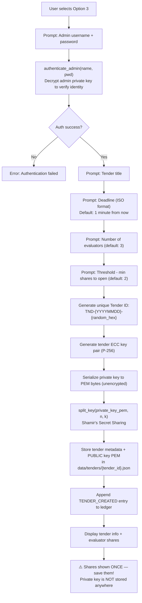
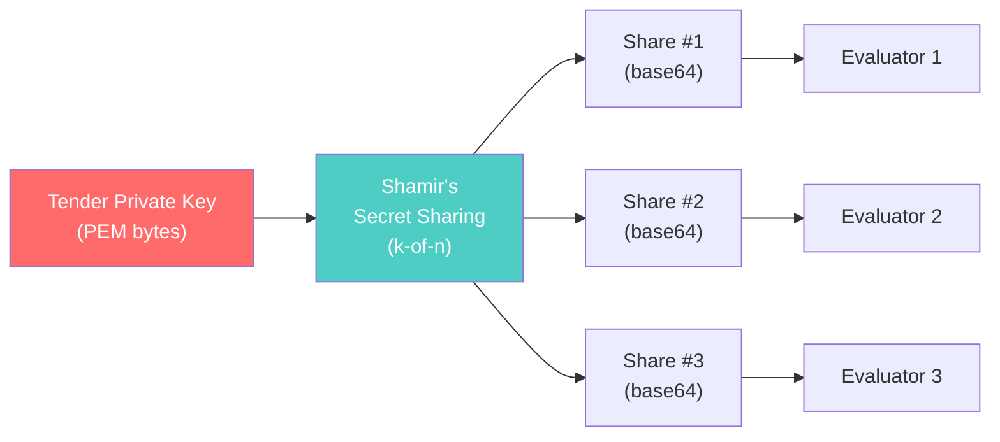

# Option 3 — Create New Tender (Admin)

## Overview

An authenticated admin creates a new **procurement tender**. The system generates an **ECC key pair** for the tender, splits the **private key** into shares using **Shamir's Secret Sharing** (k-of-n threshold scheme), and stores only the **public key** — the private key is destroyed and exists only as distributed shares. This ensures no single person can decrypt bids before the deadline.

---

## Full Workflow (Step-by-Step)



### 1. Admin Authentication
The system calls `authenticate_admin(name, password)` which attempts to load the admin's private key from `data/keys/admin_{name}_private.pem` using the provided password. If decryption fails, the operation is rejected.

### 2. Tender Configuration
| Parameter | Default | Description |
|-----------|---------|-------------|
| Title | (required) | Human-readable tender name |
| Deadline | Now + 1 minute | ISO-8601 timestamp after which bids can be opened |
| Evaluators (n) | 3 | Total number of key shares to generate |
| Threshold (k) | 2 | Minimum shares needed to reconstruct the private key |

### 3. Tender ID Generation
```python
tender_id = f"TND-{YYYYMMDD}-{os.urandom(3).hex().upper()}"
# Example: TND-20260226-A3F1B2
```

### 4. Tender ECC Key Pair
A **new, independent** ECC key pair is generated specifically for this tender:
- **Public key** → stored in the tender's JSON file; used by bidders to encrypt their bids via ECIES.
- **Private key** → immediately serialized to PEM bytes, then **split and discarded**.

### 5. Shamir's Secret Sharing — The Core Security Mechanism



```python
# The private key PEM is split using pyshamir
shares = pyshamir.split(tender_priv_pem_bytes, num_evaluators, threshold)
# Returns list of byte strings, each base64-encoded for display
```

**Key mathematical property**: Any `k` shares can reconstruct the secret; fewer than `k` shares reveal **zero information** about the secret. This is information-theoretically secure.

### 6. Tender File Stored on Disk
```json
// data/tenders/TND-20260226-A3F1B2.json
{
  "tender_id": "TND-20260226-A3F1B2",
  "title": "Office Supplies Procurement 2026",
  "deadline": "2026-02-26T13:30:00+00:00",
  "num_evaluators": 3,
  "threshold": 2,
  "public_key_pem": "-----BEGIN PUBLIC KEY-----\n...\n-----END PUBLIC KEY-----",
  "status": "OPEN",
  "created_by": "admin_demo",
  "created_at": "2026-02-26T13:00:00+00:00"
}
```

> [!IMPORTANT]
> The **private key is NOT stored** in this file or anywhere on disk. It exists only as the distributed shares.

### 7. Ledger Entry
```json
{
  "event_type": "TENDER_CREATED",
  "data_hash": "SHA-256(JSON of {tender_id, title, deadline, created_by})",
  "metadata": {
    "tender_id": "TND-20260226-A3F1B2",
    "title": "Office Supplies Procurement 2026",
    "created_by": "admin_demo"
  }
}
```

### 8. Share Distribution
Shares are displayed **once** on screen and are never stored by the system:
```
Share #1: eJx7v3e/AQADkQH1...
Share #2: eJx7v3e/AQADkQH2...
Share #3: eJx7v3e/AQADkQH3...
```

---

## Cryptographic Mechanisms Used

| Mechanism | Purpose | Algorithm/Library |
|-----------|---------|-------------------|
| ECC Key Generation | Tender-specific encryption key pair | SECP256R1 (P-256) |
| Shamir's Secret Sharing | Split private key into k-of-n shares | `pyshamir` (polynomial interpolation over GF(256)) |
| Admin Authentication | Verify admin identity before creating tender | AES-decryption of admin's private key |
| SHA-256 Hashing | Hash-chain ledger entry | SHA-256 |

---

## 🔒 Security Highlights

### What the project does well
1. **No single point of compromise** — The tender private key is split via Shamir's, so no individual can unilaterally decrypt bids. This is the **strongest security guarantee** in the entire system.
2. **Key destruction** — The unencrypted private key PEM exists only in memory during tender creation and is not persisted to disk.
3. **Configurable threshold** — The admin chooses k and n, allowing trade-offs between security (higher k) and availability (lower k).
4. **Admin authentication required** — Only authenticated admins can create tenders.

### ⚠️ Security Concerns

> [!CAUTION]
> **Shares displayed on screen in plaintext** — The shares are printed to the terminal. Anyone with screen access, screen recording, or terminal history can capture all shares at once, completely defeating the threshold scheme.

> [!CAUTION]
> **All shares generated on a single machine** — In a real system, individual evaluators should generate their own share components. Here, the admin machine sees ALL shares simultaneously before distribution.

> [!WARNING]
> **No secure share distribution channel** — The system displays shares and tells the user to "distribute securely" but provides no mechanism for this. WhatsApp, email, or post-it notes are not secure channels.

> [!WARNING]
> **Default deadline: 1 minute** — For demo purposes, the default deadline is 60 seconds from now. A careless admin in production could accidentally make a tender expire almost immediately.

> [!WARNING]
> **No minimum threshold enforcement for evaluators** — `threshold=2, evaluators=2` means all evaluators must cooperate; `threshold=2, evaluators=100` means any 2 out of 100 can collude. The system doesn't advise on safe ratios.

> [!CAUTION]
> **Master key display** — The demo output prints `Master key (demo only): ...` — though in the current ECIES implementation this shows `"N/A (Using ECIES)"`, the legacy code path suggests the system was once designed to display the raw master key.

---

## 🌍 Differences from Real-World Scenarios

| Aspect | This Prototype | Real-World e-Procurement |
|--------|---------------|--------------------------|
| **Share distribution** | Displayed on screen, manual copy | Encrypted delivery to individual HSMs or sealed envelopes with notary attestation |
| **Key ceremony** | Single admin at one terminal | Formal key ceremony with multiple witnesses, recorded on camera, in a secure facility |
| **Share storage** | Copy-paste by evaluators | Stored in tamper-evident hardware (HSM, smart card), never visible in plaintext |
| **Evaluator identity** | No verification of who receives shares | Evaluators are identity-verified officials with personal digital certificates |
| **Deadline enforcement** | Client-side UTC check | Server-side timestamp from a certified Time Stamping Authority (TSA), legally binding |
| **Tender approval** | Single admin creates instantly | Multi-level approval workflow (draft → review → publish), with legal vetting |
| **Key generation** | Software-based on general machine | Hardware Security Modules (HSMs) with FIPS 140-2/3 certification |
| **Threshold selection** | Admin's choice, no guardrails | Organizational policy dictates k/n ratios based on risk assessment |
