# Option 4 — Submit a Bid

## Overview

A registered bidder submits an encrypted, digitally signed bid for an open tender. The bid goes through a **multi-layered cryptographic pipeline**: serialization → ECDSA signing → ECIES encryption → SHA-256 hashing → ledger recording. The encrypted bid bundle is saved to disk, and its hash is recorded on the tamper-proof ledger.

---

## Full Workflow (Step-by-Step)


### 1. Bidder Verification
- Lists all registered bidders from `data/keys/` (files ending in `_private.pem`).
- Bidder must provide their name and password.
- The password is used to decrypt the bidder's private key from disk.

### 2. Tender Selection
- Lists all tenders from `data/tenders/` with their status (`OPEN` / `OPENED`).
- Bidder selects a tender by its ID.
- The system loads the tender's **public key PEM** from the tender JSON file.

### 3. Bid Data Serialization
```python
bid_payload = json.dumps({
    "bidder": "alice",
    "tender_id": "TND-20260226-A3F1B2",
    "bid_amount": 45000.0,
    "details": "Premium office supplies",
    "timestamp": "2026-02-26T13:05:00+00:00"
}, sort_keys=True).encode("utf-8")
```
> [!NOTE]
> `sort_keys=True` ensures deterministic JSON output, which is critical for hash reproducibility. Without this, the same data could produce different hashes depending on key ordering.

### 4. Digital Signature (ECDSA)
```
Input:    bid_payload (plaintext JSON bytes)
Key:      Bidder's SECP256R1 private key
Hash:     SHA-256
Output:   DER-encoded ECDSA signature bytes
```
The signature is created **before encryption** — it signs the plaintext bid. This means:
- The signature proves the bidder authored the exact bid content.
- Verification can only happen after decryption (during bid opening).

### 5. ECIES Encryption — The Core Confidentiality Mechanism

```mermaid
flowchart LR
    subgraph ECIES Encryption
        EP["Generate ephemeral<br/>ECC key pair"] --> ECDH["ECDH key agreement<br/>with tender's public key"]
        ECDH --> HKDF["HKDF-SHA256<br/>derive AES-256 key"]
        HKDF --> AES["AES-256-GCM<br/>encrypt bid payload"]
    end
    
    AES --> Bundle["Encrypted Bundle:<br/>• ephemeral_pub (base64)<br/>• nonce (12 bytes, base64)<br/>• ciphertext (base64)"]
```



**Detailed steps:**
1. **Ephemeral key pair** — A brand-new P-256 key pair is generated specifically for this encryption.
2. **ECDH** — The ephemeral private key + tender's public key → shared secret.
3. **HKDF (SHA-256)** — The shared secret is derived into a 32-byte AES key with info=`b"cseps-ecies"`.
4. **AES-256-GCM** — A 12-byte random nonce is generated; the bid payload is encrypted with AES-256-GCM (providing both confidentiality and authenticity).
5. **Output** — The ephemeral public key, nonce, and ciphertext are base64-encoded.

### 6. Bid Bundle Assembly
```json
{
  "bidder": "alice",
  "tender_id": "TND-20260226-A3F1B2",
  "encrypted_bid": {
    "ephemeral_pub": "<base64 — 65 bytes uncompressed point>",
    "nonce": "<base64 — 12 bytes>",
    "ciphertext": "<base64 — encrypted bid + 16-byte GCM tag>"
  },
  "signature": "<base64 — DER-encoded ECDSA signature>",
  "payload_hash": "<64-char SHA-256 hex of plaintext bid>",
  "submitted_at": "2026-02-26T13:05:00+00:00"
}
```

### 7. Bundle Hashing & Ledger Entry
```python
bundle_bytes = json.dumps(bid_bundle, sort_keys=True).encode("utf-8")
bundle_hash = SHA256(bundle_bytes)  # Hash of the ENTIRE bundle
```
This hash is recorded on the ledger:
```json
{
  "event_type": "BID_SUBMITTED",
  "data_hash": "SHA-256(bundle_hash)",
  "metadata": {
    "bidder": "alice",
    "tender_id": "TND-20260226-A3F1B2"
  }
}
```

### 8. File Storage
The encrypted bundle is saved to:
```
data/bids/TND-20260226-A3F1B2_alice.json
```

---

## Cryptographic Mechanisms Used

| Mechanism | Purpose | Algorithm |
|-----------|---------|-----------|
| ECDSA Signing | Non-repudiation — bidder cannot deny authoring the bid | ECDSA with SHA-256 on P-256 |
| ECIES Encryption | Bid confidentiality — only the reconstructed private key can decrypt | ECDH + HKDF-SHA256 + AES-256-GCM |
| SHA-256 (payload) | Integrity check of plaintext bid after decryption | SHA-256 |
| SHA-256 (bundle) | Tamper detection of the entire encrypted bundle | SHA-256 |
| AES-256-GCM | Authenticated encryption (confidentiality + integrity) | AES-256-GCM with 12-byte nonce |
| Password decryption | Authenticate bidder by decrypting private key | AES (key file encryption) |

---

## 🔒 Security Highlights

### What the project does well
1. **Sign-then-encrypt** — The bid is signed BEFORE encryption, so the signature covers the plaintext. This provides non-repudiation: the bidder cannot deny their bid content after decryption.
2. **ECIES with ephemeral keys** — Each encryption uses a fresh ephemeral key pair, providing forward secrecy for individual bid encryptions.
3. **AES-256-GCM** — Authenticated encryption prevents both ciphertext tampering and provides confidentiality.
4. **Double hashing** — Both the plaintext payload and the full bundle are hashed, detecting tampering at both the encryption layer and the content layer.
5. **Deterministic serialization** — `sort_keys=True` prevents hash inconsistencies from JSON key ordering.

### ⚠️ Security Concerns

> [!CAUTION]
> **Bidder name visible in plaintext** — The bid bundle stores `"bidder": "alice"` in the clear. Anyone with filesystem access can see who submitted a bid for which tender, breaking bidder anonymity before the deadline.

> [!WARNING]
> **No deadline check at submission time** — The system does NOT prevent bid submission after the deadline. It only enforces the deadline during bid opening (Option 5). A bid can be submitted to a closed tender.

> [!WARNING]
> **Filename reveals bidder-tender mapping** — The file `TND-20260226-A3F1B2_alice.json` immediately reveals which bidder bid on which tender.

> [!WARNING]
> **payload_hash exposes plaintext hash** — The SHA-256 of the plaintext bid is stored in the clear bundle. While this doesn't directly reveal the bid amount, it enables dictionary attacks: if someone guesses the bid content (e.g., tries all amounts from $1 to $1M), they can confirm a match via the hash.

> [!CAUTION]
> **No bid modification or withdrawal** — Once submitted, a bid cannot be updated or withdrawn. The system provides no mechanism for corrections.

---

## 🌍 Differences from Real-World Scenarios

| Aspect | This Prototype | Real-World e-Procurement |
|--------|---------------|--------------------------|
| **Bid confidentiality** | Bidder name in plaintext, encrypted content | Full envelope encryption: bidder identity, content, and metadata all encrypted or anonymized |
| **Submission channel** | Local file write | TLS-encrypted submission to a central server with timestamp receipt |
| **Deadline enforcement** | Not enforced at submission | Server-side deadline enforcement; late submissions rejected with a cryptographic proof of time |
| **Bid receipt** | No explicit receipt | Cryptographically signed receipt from the server (proves submission time and content hash) |
| **Bid withdrawal** | Not supported | Allowed within a withdrawal window, with ledger audit trail |
| **Bid encryption key** | Tender's ECC public key | Combination of key escrow + threshold encryption, often with hardware-backed keys |
| **Anonymity** | Filename and JSON expose bidder identity | Bidder identity sealed in an inner encrypted envelope, separated from the bid envelope |
| **Timestamping** | Local UTC timestamp (easily spoofed) | Certified TSA (Time Stamping Authority) per RFC 3161 |
| **Duplicate bids** | Overwrites previous bid file silently | Controlled re-submission with versioning and diff logging |
