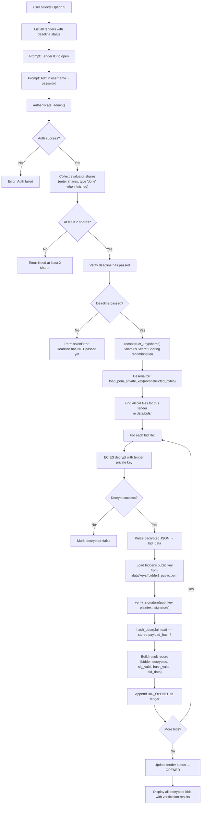
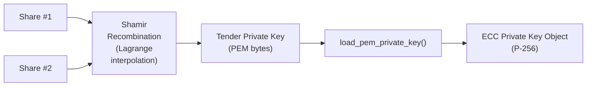
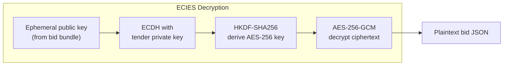

# Option 5 — Open Bids After Deadline (Admin)

## Overview

This is the **most security-critical** operation in the entire system. An authenticated admin, together with evaluators holding key shares, reconstructs the tender's **private key** from Shamir shares to **decrypt all submitted bids**. Each decrypted bid is verified for **signature authenticity** (ECDSA) and **data integrity** (SHA-256 hash comparison). All events are logged to the tamper-proof ledger.

---

## Full Workflow (Step-by-Step)



### 1. Tender Listing & Selection
All tenders are listed with deadlines and pass/fail status:
```
TND-20260226-A3F1B2  Office Supplies  [DEADLINE PASSED ✓]
TND-20260226-B4C2D1  IT Equipment     [STILL OPEN]
```

### 2. Admin Authentication
Same mechanism as Option 3 — decrypt admin private key to prove identity.

### 3. Share Collection
Evaluators enter their shares one by one:
```
Share #1 (or 'done'): eJx7v3e/AQADkQH1...
Share #2 (or 'done'): eJx7v3e/AQADkQH2...
Share #3 (or 'done'): done
```
Minimum 2 shares required (hardcoded check).

### 4. Deadline Enforcement
```python
def is_deadline_passed(tender):
    deadline = datetime.fromisoformat(tender["deadline"])
    return datetime.now(timezone.utc) >= deadline
```
If the deadline has NOT passed, the system raises `PermissionError` and refuses to proceed.

### 5. Key Reconstruction (Shamir's Secret Sharing)



```python
tender_priv_pem = pyshamir.combine(shares)  # Reconstruct PEM bytes
master_key = serialization.load_pem_private_key(tender_priv_pem, password=None)
```

### 6. Bid Decryption (ECIES)

For each bid file matching `{tender_id}_*.json`:



### 7. Signature Verification (ECDSA)
```python
# Load the bidder's public key
pub_key = load_public_key(f"data/keys/{bidder}_public.pem")

# Verify: was this plaintext signed by this bidder's private key?
public_key.verify(signature, plaintext, ECDSA(SHA256()))
```

### 8. Hash Integrity Check
```python
computed_hash = SHA256(decrypted_plaintext)
hash_valid = (computed_hash == bid_bundle["payload_hash"])
```
This confirms the decrypted content matches the hash committed at submission time.

### 9. Output Display
```
Bidder: alice
    Decrypted:  Yes
    Signature:  ✓ VALID
    Hash:       ✓ INTACT
    Amount:     45000.0
    Details:    Premium office supplies
    Timestamp:  2026-02-26T13:05:00+00:00
```

### 10. Tender Status Update
The tender JSON is updated: `"status": "OPENED"`.

---

## Cryptographic Mechanisms Used

| Mechanism | Purpose | Algorithm |
|-----------|---------|-----------|
| Shamir's Secret Sharing (reconstruct) | Reconstruct tender private key from k shares | Lagrange interpolation over GF(256) |
| ECIES Decryption | Decrypt bid ciphertext | ECDH + HKDF-SHA256 + AES-256-GCM |
| ECDSA Verification | Verify bidder's signature on plaintext bid | ECDSA with SHA-256 on P-256 |
| SHA-256 Hash Comparison | Verify plaintext integrity against committed hash | SHA-256 |
| Admin key decryption | Authenticate admin identity | AES decryption of admin private key |

---

## 🔒 Security Highlights

### What the project does well
1. **Threshold decryption** — No single person can open bids. The threshold (k-of-n) scheme requires collaboration.
2. **Deadline enforcement** — The system refuses to decrypt bids before the deadline.
3. **Three-way verification** — Each bid is checked for: (a) successful decryption, (b) valid ECDSA signature, (c) intact payload hash. All three must pass for a bid to be considered trustworthy.
4. **Bid opening logged** — Every individual bid open event is recorded on the ledger with the admin's identity, creating an audit trail.
5. **Non-repudiation** — Because the signature was made on the plaintext by the bidder's private key, the bidder cannot deny submitting the bid.

### ⚠️ Security Concerns

> [!CAUTION]
> **Shares entered on one machine** — All evaluator shares are typed into the same terminal on the same machine. In a real ceremony, each evaluator should input their share on a separate secure terminal, or use a multi-party computation (MPC) protocol so no single machine ever holds all shares.

> [!CAUTION]
> **Reconstructed private key exists in memory** — After reconstruction, the full tender private key is loaded as a Python object and used to decrypt all bids. A memory dump, debugger, or malicious process could capture the key.

> [!WARNING]
> **Deadline based on local clock** — `datetime.now(timezone.utc)` uses the machine's system clock. An attacker with root access could simply set the clock forward to bypass the deadline.

> [!WARNING]
> **No limit on re-opening** — The tender status is updated to `OPENED`, but there's no mechanism to prevent the admin from opening bids again with the same shares. The keys can be used repeatedly.

> [!WARNING]
> **All bids decrypted at once** — All bids for the tender are decrypted in a single batch. There's no support for selective or sequential opening, which some protocols require.

> [!CAUTION]
> **Hardcoded minimum of 2 shares** — The system checks `len(shares) < 2`, not the actual threshold defined when the tender was created. If the tender was created with `threshold=3`, the system would still attempt reconstruction with 2 shares (which would produce a wrong key and fail silently or produce garbage).

---

## 🌍 Differences from Real-World Scenarios

| Aspect | This Prototype | Real-World e-Procurement |
|--------|---------------|--------------------------|
| **Key ceremony** | Shares typed into one terminal | Multi-party computation (MPC) — no single entity ever sees the full key; or sealed-room ceremony with witnesses |
| **Clock source** | Local system clock | Certified NTP server or TSA (Time Stamping Authority) |
| **Bid opening** | All at once, one admin | Formal bid opening ceremony with multiple witnesses; often live-streamed or recorded |
| **Key erasure** | No explicit secure erasure | Cryptographic key zeroization after use; memory scrubbing |
| **Re-opening** | No protection against re-opening | One-time-use keys, audited key ceremonies, sealed audit logs |
| **Selective opening** | Not supported | Commitment schemes allow selective verifiable opening |
| **Dispute resolution** | None | Zero-knowledge proofs or commitment schemes for disputed bids |
| **Share authentication** | Base64 strings, no integrity check | Shares are authenticated (e.g., HMAC'd or wrapped in PKI-signed containers) |
