# Option 6 — Verify Ledger Integrity

## Overview

Performs a **full hash-chain verification** of the append-only ledger — the system's equivalent of a mini-blockchain. Every ledger entry's hash is recomputed and compared against the stored value, and every entry's `previous_hash` link is verified against the preceding entry. Any modification, insertion, or deletion of ledger entries will be detected.

---

## Full Workflow (Step-by-Step)

```mermaid
flowchart TD
    A[User selects Option 6] --> B["Load entire ledger from data/ledger.json"]
    B --> C{Ledger empty?}
    C -- Yes --> D["Valid: empty ledger (0 entries)"]
    C -- No --> E["For each entry i in chain:"]
    E --> F["Check 1: previous_hash match"]
    F --> G{"entry[i].previous_hash ==<br/>entry[i-1].entry_hash?<br/>(genesis = '0'×64 for i=0)"}
    G -- Mismatch --> H["Record error:<br/>'Entry #i: previous_hash mismatch'"]
    G -- Match --> I["Check 2: Recompute self-hash"]
    I --> J["expected = SHA-256(<br/>str(index) + timestamp +<br/>event_type + data_hash +<br/>previous_hash)"]
    J --> K{"entry[i].entry_hash<br/>== expected?"}
    K -- Mismatch --> L["Record error:<br/>'Entry #i: entry_hash mismatch'"]
    K -- Match --> M{More entries?}
    H --> M
    L --> M
    M -- Yes --> E
    M -- No --> N{Any errors?}
    N -- No --> O["✓ VALID — all N entries verified"]
    N -- Yes --> P["✗ COMPROMISED — show errors"]
```



### 1. Ledger Loading
The entire `data/ledger.json` is loaded — it's a JSON array of entry objects.

### 2. Chain Verification Algorithm

For each entry `i` (from `0` to `N-1`):

**Check A — Previous Hash Link:**
```python
expected_prev = chain[i-1]["entry_hash"] if i > 0 else "0" * 64  # genesis
if entry["previous_hash"] != expected_prev:
    errors.append(f"Entry #{i}: previous_hash mismatch")
```

**Check B — Self-Hash Integrity:**
```python
payload = str(entry["index"]) + entry["timestamp"] + entry["event_type"] 
          + entry["data_hash"] + entry["previous_hash"]
expected_hash = SHA256(payload)
if entry["entry_hash"] != expected_hash:
    errors.append(f"Entry #{i}: entry_hash mismatch")
```

### 3. Hash Chain Visualization


### 4. Output
```
[INFO]  Total entries in ledger: 12
[  OK ]  Ledger integrity: VALID ✓  (12 entries verified)
```
Or if compromised:
```
[FAIL]  Ledger integrity: COMPROMISED ✗  (2 error(s))
    ✗ Entry #5: previous_hash mismatch (expected abc...., got fff....)
    ✗ Entry #5: entry_hash mismatch (expected def...., got 000....)
```

---

## Cryptographic Mechanisms Used

| Mechanism | Purpose | Algorithm |
|-----------|---------|-----------|
| SHA-256 Hash Chain | Detect any modification, insertion, or deletion of entries | SHA-256 |
| Hash Linking | Each entry's hash covers the previous entry's hash, creating a chain | Chained SHA-256 |

---

## What the Hash Chain Detects

| Attack | Detection |
|--------|-----------|
| **Modify an entry** (change data, timestamp, etc.) | Self-hash mismatch at the modified entry |
| **Delete an entry** | Index gap detected; previous_hash mismatch at the following entry |
| **Insert a fake entry** | previous_hash mismatch at the inserted entry and/or the next entry |
| **Reorder entries** | both hash mismatches at affected entries |
| **Replace the entire ledger** | Only works if the attacker recalculates ALL hashes from genesis. Solved in real systems by distributed copies. |

---

## 🔒 Security Highlights

### What the project does well
1. **Complete chain verification** — Every single entry is checked for both self-integrity and chain-link integrity.
2. **Genesis anchor** — The chain starts from a deterministic genesis hash (`"0"*64`), preventing forged alternate histories.
3. **Hash covers all critical fields** — Index, timestamp, event type, data hash, and previous hash are all included in the hash computation.
4. **Public verifiability** — Anyone can run this check; no secrets needed.

### ⚠️ Security Concerns

> [!CAUTION]
> **Single-copy ledger** — The ledger is a single `ledger.json` file on one machine. An attacker with write access can rewrite the entire chain from genesis, recalculating all hashes, and the verification will still pass. Real blockchains solve this with distributed consensus.

> [!WARNING]
> **No digital signatures on entries** — Entries are not signed by any authority. Anyone with file access can forge entries with valid hashes. A real ledger would have each entry digitally signed by the submitting party.

> [!WARNING]
> **Metadata NOT included in hash** — The `metadata` field (containing human-readable info like bidder names, tender IDs) is NOT covered by the entry hash. An attacker could modify metadata without breaking the hash chain.

> [!WARNING]
> **No concurrent access protection** — If two processes write to the ledger simultaneously, data corruption or race conditions could occur, potentially breaking the chain. No file locking is implemented.

> [!WARNING]
> **No timestamping authority** — Timestamps are generated from the local system clock. An attacker with system access could backdate entries.

---

## 🌍 Differences from Real-World Scenarios

| Aspect | This Prototype | Real-World e-Procurement |
|--------|---------------|--------------------------|
| **Ledger copies** | Single JSON file on one machine | Distributed ledger across multiple nodes (blockchain consensus) |
| **Entry signing** | No signatures, hash-only | Each entry signed by the submitter's digital certificate |
| **Timestamping** | Local `datetime.now(UTC)` | RFC 3161 Trusted Timestamping Authority (TSA) |
| **Tamper evidence** | Hash chain (detectable if single-copy compromised) | Distributed consensus makes tampering computationally infeasible |
| **Metadata integrity** | Not hash-protected | All fields covered by hash and signature |
| **Access control** | Any process can write to ledger.json | Write-access mediated by authenticated API + consensus protocol |
| **Long-term storage** | JSON file, no backup | Immutable archival storage with geographic redundancy |
| **Formal certification** | None | Ledger certified by auditing authorities; ISO 27001 compliant |
