# Option 7 — Verify a Bid File

## Overview

Verifies the **integrity** of an encrypted bid file **without decrypting it**. The system recomputes the SHA-256 hash of the bid bundle and checks whether this hash was recorded in the ledger at submission time. This proves the encrypted bid has not been tampered with since submission, even without seeing the plaintext.

---

## Full Workflow (Step-by-Step)

```mermaid
flowchart TD
    A[User selects Option 7] --> B["List all .json files in data/bids/"]
    B --> C{Any bid files?}
    C -- No --> D[Warn: No bid files found]
    C -- Yes --> E[Display available bid files]
    E --> F[Prompt: Select bid filename]
    F --> G{File exists?}
    G -- No --> H[Error: File not found]
    G -- Yes --> I["Load bid bundle JSON"]
    I --> J["Re-serialize with sort_keys=True"]
    J --> K["Compute SHA-256 of serialized bundle"]
    K --> L["Load all BID_SUBMITTED ledger entries"]
    L --> M["Search for matching data_hash"]
    M --> N{"Hash found<br/>in ledger?"}
    N -- Yes --> O["✓ Hash recorded in ledger"]
    N -- No --> P["✗ Hash NOT in ledger<br/>(file may be tampered/unrecorded)"]
    O --> Q["Display verification report"]
    P --> Q
```



### 1. Bid File Discovery
The system lists all `.json` files in `data/bids/`:
```
Available bid files:
    TND-20260226-A3F1B2_alice.json
    TND-20260226-A3F1B2_bob.json
```

### 2. Bundle Hash Recomputation
```python
bid_bundle = read_json(filepath)
bundle_bytes = json.dumps(bid_bundle, sort_keys=True).encode("utf-8")
current_hash = SHA256(bundle_bytes)
```
This computes the hash of the bid bundle **as it currently exists on disk**.

### 3. Ledger Cross-Reference
```python
submissions = ledger.get_entries("BID_SUBMITTED")
hash_in_ledger = any(
    entry["data_hash"] == SHA256(current_hash) 
    for entry in submissions
)
```

> [!NOTE]
> The ledger stores `SHA256(bundle_hash)` — a **double hash**. The `data_hash` field in the ledger is `SHA256(hash_string(bundle_hash))` because `add_entry()` hashes the `data` parameter. So the comparison is: `entry["data_hash"] == SHA256(current_hash)`.

### 4. Verification Report Output
```
Bidder:       alice
Tender:       TND-20260226-A3F1B2
Submitted:    2026-02-26T13:05:00+00:00
Payload hash: a1b2c3d4e5f6789012345678901234567890...
Bundle hash:  9f8e7d6c5b4a3210fedcba9876543210abcd...
In ledger:    ✓
```

---

## What This Verification Proves

| Verified? | Meaning |
|-----------|---------|
| **Bundle hash matches ledger** | The encrypted bid file on disk is identical to what was submitted. No bytes have been modified, added, or removed since the hash was recorded. |
| **Bundle hash does NOT match ledger** | Either: (a) the bid file was tampered with, (b) the file was never properly submitted, or (c) the ledger itself was compromised. |

### What this does NOT verify:
- ❌ **Bid content** — The bid remains encrypted; content is not examined.
- ❌ **Bidder's signature** — The ECDSA signature is inside the encrypted payload and is only verified during bid opening (Option 5).
- ❌ **Ledger integrity** — This option does not verify the ledger chain itself. Run Option 6 first to ensure the ledger is intact.

---

## Cryptographic Mechanisms Used

| Mechanism | Purpose | Algorithm |
|-----------|---------|-----------|
| SHA-256 (bundle) | Recompute current file's hash | SHA-256 |
| Ledger lookup | Cross-reference hash with recorded submission | String comparison of hex digests |

---

## 🔒 Security Highlights

### What the project does well
1. **Verification without decryption** — This is a powerful property: anyone can verify bid integrity without needing the decryption key. The encrypted bundle's hash is sufficient.
2. **Tamper detection** — Even a single-bit change to the bid file would produce a completely different SHA-256 hash, failing the ledger check.
3. **Independent verification** — Any third party with access to the bid file and ledger can perform this check.

### ⚠️ Security Concerns

> [!WARNING]
> **Ledger itself is not verified here** — If the ledger has been tampered with, this check provides false assurances. Always run Option 6 (Verify Ledger) before trusting bid file verification.

> [!WARNING]
> **Double-hashing may cause confusion** — The ledger stores `SHA256(SHA256(bundle))` due to `add_entry()` hashing the data parameter internally. This makes manual verification less intuitive and could introduce implementation bugs.

> [!WARNING]
> **No signature verification** — This option cannot confirm the bid was created by the claimed bidder. The ECDSA signature is embedded in the encrypted payload and requires decryption to verify.

> [!WARNING]
> **payload_hash is displayed but not verified against anything** — The `payload_hash` (hash of the plaintext) is shown but cannot be verified because the bid is still encrypted. It's informational only at this stage.

---

## 🌍 Differences from Real-World Scenarios

| Aspect | This Prototype | Real-World e-Procurement |
|--------|---------------|--------------------------|
| **Verification scope** | Hash comparison only | Full PKI-based verification: check CA chain, certificate validity, CRL/OCSP, timestamping |
| **Non-repudiation** | Cannot verify at this stage | Outer envelope has a detached signature that can be verified without decryption |
| **Timestamp proof** | Local timestamp in JSON | RFC 3161 timestamp token from certified TSA, independently verifiable |
| **Ledger trust** | Local file, must verify separately | Distributed ledger — no single point of tampering |
| **Bidder anonymity in verification** | Bidder name visible in bundle | Verification possible without revealing bidder identity (zero-knowledge proof) |
| **Public audit tool** | CLI option on same machine | Web-based public portal where any citizen can verify bid integrity |
