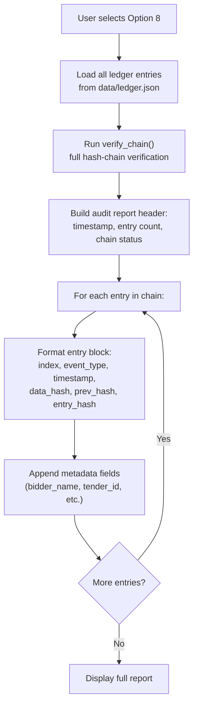

# Option 8 — View Audit Log

## Overview

Generates a comprehensive **public audit report** of all events in the tamper-proof ledger. This is the transparency mechanism of CSePS — it allows anyone to review the complete chronological history of registrations, tender creation, bid submissions, and bid openings.

---

## Full Workflow (Step-by-Step)



### 1. Report Generation
The `generate_audit_report()` function in `verifier.py` does:
1. Loads ALL ledger entries (no filtering).
2. Runs full chain verification (`verify_chain()`).
3. Formats a human-readable report.

### 2. Report Structure

```
================================================================
         CSePS — PUBLIC AUDIT REPORT
================================================================
  Report generated: 2026-02-26T13:15:00+00:00
  Total ledger entries: 12
  Chain integrity: VALID ✓
================================================================

  [   0]  BIDDER_REGISTERED
         Time:       2026-02-26T13:00:00+00:00
         Data Hash:  a1b2c3d4e5f67890123456789012...
         Prev Hash:  00000000000000000000000000000000...
         Entry Hash: 9f8e7d6c5b4a3210fedcba987654...
         bidder_name: alice

  [   1]  BIDDER_REGISTERED
         Time:       2026-02-26T13:00:01+00:00
         Data Hash:  b2c3d4e5f678901234567890123456...
         Prev Hash:  9f8e7d6c5b4a3210fedcba987654...
         Entry Hash: c3d4e5f6789012345678901234567...
         bidder_name: bob

  [   2]  TENDER_CREATED
         Time:       2026-02-26T13:01:00+00:00
         Data Hash:  ...
         Prev Hash:  c3d4e5f678901234567890123456...
         Entry Hash: d4e5f67890123456789012345678...
         tender_id: TND-20260226-A3F1B2
         title: Office Supplies Procurement 2026
         created_by: admin_demo

  [   3]  BID_SUBMITTED
         Time:       2026-02-26T13:05:00+00:00
         Data Hash:  ...
         Prev Hash:  d4e5f6789012345678901234567...
         Entry Hash: e5f678901234567890123456789...
         bidder: alice
         tender_id: TND-20260226-A3F1B2

  ...

================================================================
  END OF AUDIT REPORT
================================================================
```

### 3. Event Types in the Audit Trail

| Event Type | When Logged | Key Metadata |
|-----------|-------------|--------------|
| `BIDDER_REGISTERED` | Option 1 — Bidder registration | `bidder_name` |
| `ADMIN_REGISTERED` | Option 2 — Admin registration | `admin_name` |
| `TENDER_CREATED` | Option 3 — Tender creation | `tender_id`, `title`, `created_by` |
| `BID_SUBMITTED` | Option 4 — Bid submission | `bidder`, `tender_id` |
| `BID_OPENED` | Option 5 — Bid opening | `tender_id`, `bidder`, `signature_valid`, `opened_by` |

---

## Cryptographic Mechanisms Used

| Mechanism | Purpose | Algorithm |
|-----------|---------|-----------|
| Hash-chain verification | Ensure ledger hasn't been tampered with | SHA-256 chain walk |
| SHA-256 display | Show truncated hashes for each entry | SHA-256 hex digest |

---

## 🔒 Security Highlights

### What the project does well
1. **Combined verification + report** — The audit report always includes a fresh chain integrity check, so the reader knows whether the data is trustworthy.
2. **Complete transparency** — Every significant system action is visible in the report.
3. **Truncated hashes** — Hashes are shown as `<first 32 chars>…` for readability while still being verifiable.
4. **No secrets exposed** — The audit log contains only hashes and metadata; no bid content, private keys, or passwords.

### ⚠️ Security Concerns

> [!WARNING]
> **Metadata reveals bidder-tender relationships** — The audit log shows which bidder submitted to which tender (e.g., `bidder: alice, tender_id: TND-...`). This breaks bidder anonymity for anyone viewing the log before the deadline.

> [!WARNING]
> **Timestamps can be spoofed** — Since timestamps come from the local clock, a compromised system could log events with false timestamps, creating a misleading chronology.

> [!WARNING]
> **No access control on audit report** — Anyone running the CLI can view the full audit log. While transparency is desirable post-deadline, pre-deadline access to submission metadata is a privacy concern.

> [!WARNING]
> **No report signing** — The audit report is ephemeral text output. It is not signed or hashed by a trusted authority, so a photocopy or screenshot of the report cannot be independently verified.

---

## 🌍 Differences from Real-World Scenarios

| Aspect | This Prototype | Real-World e-Procurement |
|--------|---------------|--------------------------|
| **Report format** | Plain text to terminal | Digitally signed PDF/XML with TSA timestamp, legally admissible as evidence |
| **Access control** | Anyone with CLI access | Role-based: public after opening; restricted metadata before deadline |
| **Bidder anonymity** | Bidder names visible in pre-deadline entries | Anonymized bidder references until formal opening ceremony |
| **Report certification** | None | Signed by audit authority, counter-signed by independent auditor |
| **Report distribution** | Screen output | Published to official gazette or procurement portal; archived permanently |
| **Real-time monitoring** | Manually triggered | Automated monitoring with alerts for suspicious patterns |
| **Legal standing** | None (prototype) | Constitutes legal evidence per procurement regulations |
