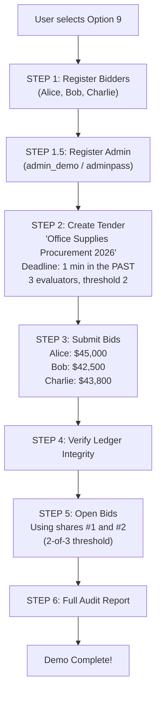

# Option 9 — Demo: Full End-to-End Workflow

## Overview

Runs a **fully automated demonstration** of the entire CSePS procurement lifecycle in a single operation. This option orchestrates all other options (1–8) sequentially, creating sample bidders, an admin, a tender, bids, verifying the ledger, opening bids, and generating an audit report — all without user interaction.

---

## Full Workflow (Step-by-Step)



### Step 1: Register Bidders
```python
for name in ["Alice", "Bob", "Charlie"]:
    bidder_mod.register_bidder(name, "demopass")
```
- Creates ECC key pairs for all three bidders.
- Password for all: `"demopass"`.
- If already registered, skips gracefully.

### Step 1.5: Register Admin
```python
admin_mod.register_admin("admin_demo", "adminpass")
```
- Creates admin with password `"adminpass"`.
- If already registered, skips gracefully.

### Step 2: Create Tender
```python
past_deadline = (datetime.now(UTC) - timedelta(minutes=1)).isoformat()
tender_result = admin_mod.create_tender(
    title="Office Supplies Procurement 2026",
    deadline_iso=past_deadline,     # ← Deadline set to 1 minute AGO
    num_evaluators=3,
    threshold=2,
    admin_name="admin_demo",
    admin_password="adminpass",
)
```

> [!NOTE]
> The deadline is deliberately set **in the past** so that bids can be opened immediately during the demo.

**Output:**
- Tender ID (e.g., `TND-20260226-A3F1B2`)
- 3 Shamir shares (base64-encoded, truncated for display)
- The system retains all shares in memory for step 5.

### Step 3: Submit Bids
```python
bids = [
    ("alice",   45000, "Premium office supplies"),
    ("bob",     42500, "Standard office supplies"),
    ("charlie", 43800, "Eco-friendly office supplies"),
]
for bidder_name, amount, details in bids:
    bidder_mod.submit_bid(bidder_name, tender_id, amount, details, "demopass")
```
Each bid goes through the full pipeline:
1. Serialize → 2. ECDSA sign → 3. ECIES encrypt → 4. Hash → 5. Ledger → 6. Save to disk.

### Step 4: Verify Ledger
```python
is_valid, errors = verifier_mod.verify_ledger_integrity()
```
Full chain walk — should report `VALID ✓` at this point.

### Step 5: Open Bids (Threshold Decryption)
```python
# Using only shares #1 and #2 (2-of-3)
results = admin_mod.open_bids(
    tender_id, 
    [shares[0], shares[1]],  # Only 2 of 3 shares needed
    "admin_demo", "adminpass"
)
```

**Output for each bid:**
```
alice        $  45000.0  Sig: ✓ VALID  Hash: ✓ INTACT
bob          $  42500.0  Sig: ✓ VALID  Hash: ✓ INTACT
charlie      $  43800.0  Sig: ✓ VALID  Hash: ✓ INTACT
```

### Step 6: Full Audit Report
```python
report = verifier_mod.generate_audit_report()
print(report)
```
Displays the complete ledger audit with all entries from steps 1-5.

---

## Complete Cryptographic Pipeline (End-to-End)

```mermaid
flowchart TB
    subgraph "Registration (Steps 1-1.5)"
        R1["ECC keygen<br/>(P-256)"] --> R2["Key storage<br/>(PEM + AES encryption)"]
        R2 --> R3["Ledger:<br/>BIDDER_REGISTERED<br/>ADMIN_REGISTERED"]
    end
    
    subgraph "Tender Creation (Step 2)"
        T1["ECC keygen<br/>(tender keys)"] --> T2["Shamir split<br/>(3 shares, threshold 2)"]
        T2 --> T3["Store public key<br/>+ tender metadata"]
        T3 --> T4["Ledger:<br/>TENDER_CREATED"]
    end
    
    subgraph "Bid Submission (Step 3)"
        B1["Serialize bid"] --> B2["ECDSA sign<br/>(bidder's private key)"]
        B2 --> B3["ECIES encrypt<br/>(tender's public key)"]
        B3 --> B4["SHA-256 hash bundle"]
        B4 --> B5["Ledger:<br/>BID_SUBMITTED"]
    end
    
    subgraph "Verification (Step 4)"
        V1["Walk hash chain"] --> V2["Verify each entry's<br/>self-hash + prev-hash link"]
    end
    
    subgraph "Bid Opening (Step 5)"
        O1["Shamir recombine<br/>(2 of 3 shares)"] --> O2["ECIES decrypt<br/>(tender's private key)"]
        O2 --> O3["ECDSA verify<br/>(bidder's public key)"]
        O3 --> O4["SHA-256 compare<br/>(hash integrity)"]
        O4 --> O5["Ledger:<br/>BID_OPENED"]
    end
    
    R3 --> T1
    T4 --> B1
    B5 --> V1
    V2 --> O1
```



---

## All Cryptographic Algorithms Used in the Demo

| Algorithm | Standard | Used In | Purpose |
|-----------|----------|---------|---------|
| **ECC (SECP256R1 / P-256)** | NIST FIPS 186-4 | Key generation | Identity key pairs (bidders, admins, tenders) |
| **ECDSA** | NIST FIPS 186-4 | Bid signing + verification | Non-repudiation: prove bidder authored the bid |
| **ECDH** | NIST SP 800-56A | ECIES encryption | Derive shared secret between ephemeral key and tender key |
| **HKDF-SHA256** | RFC 5869 | ECIES encryption | Derive AES key from ECDH shared secret |
| **AES-256-GCM** | NIST SP 800-38D | ECIES encryption | Authenticated encryption of bid payload |
| **SHA-256** | FIPS 180-4 | Hashing everywhere | Hash-chain, payload hash, bundle hash, data hashes |
| **Shamir's Secret Sharing** | Adi Shamir (1979) | Key splitting | Split tender private key into k-of-n shares |

---

## 🔒 Security Highlights

### What the demo demonstrates well
1. **Complete lifecycle** — Shows the full arc from registration through closing, proving all cryptographic layers work together coherently.
2. **Threshold scheme in action** — Only 2 of 3 shares are used, demonstrating that the full set is not needed.
3. **Three-way bid validation** — Decryption success + signature validity + hash integrity, all passing for every bid.
4. **Immutable audit trail** — The ledger captures every event, and the chain verification passes at the end.

### ⚠️ Security Concerns

> [!CAUTION]
> **Hardcoded passwords** — All bidders use `"demopass"` and the admin uses `"adminpass"`. These passwords are plaintext in the source code. If this demo data persists, the keys are trivially compromised.

> [!CAUTION]
> **All shares in memory** — The demo retains all 3 Shamir shares in the same Python process and uses 2 of them for reconstruction. This means a single process holds all the information needed to decrypt — the entire point of threshold splitting (distributing trust) is bypassed.

> [!WARNING]
> **Past deadline trick** — The demo sets the deadline to 1 minute in the past to allow immediate bid opening. This is a realistic attack vector an admin could use in production if the system doesn't enforce minimum deadline durations.

> [!WARNING]
> **No cleanup** — Demo data (keys, bids, tenders, ledger entries) persists after the demo. Running the demo multiple times pollutes the data directory and could cause confusion or errors.

> [!WARNING]
> **Same machine = no real distribution** — The entire point of a procurement system is distributing trust across parties. The demo runs everything on one machine, in one process, from one user — which is the opposite of secure procurement.

---

## 🌍 Differences from Real-World Scenarios

| Aspect | This Demo | Real-World Procurement |
|--------|-----------|------------------------|
| **Participants** | One person, one machine | Multiple organizations, multiple machines, different networks |
| **Identity** | Self-registered, no verification | Government-issued digital certificates, KYC, background checks |
| **Key management** | PEM files on disk, hardcoded passwords | HSMs, smart cards, air-gapped key ceremonies |
| **Share distribution** | Same process holds all shares | Shares distributed to physically separated, independent evaluators |
| **Timeline** | 1-minute deadline in the past | Weeks to months, with legal notice periods |
| **Communication channels** | Same terminal | Encrypted channels (TLS, S/MIME), registered mail |
| **Legal framework** | None | Government procurement regulations (e.g., GFR/CVC rules in India, FAR in USA) |
| **Dispute resolution** | None | Formal grievance mechanism, independent review bodies, courts |
| **Scalability** | 3 bidders, 1 tender | Thousands of bidders, hundreds of concurrent tenders |
| **Availability** | Single machine, no redundancy | High-availability clusters, disaster recovery, 99.9%+ uptime SLA |
